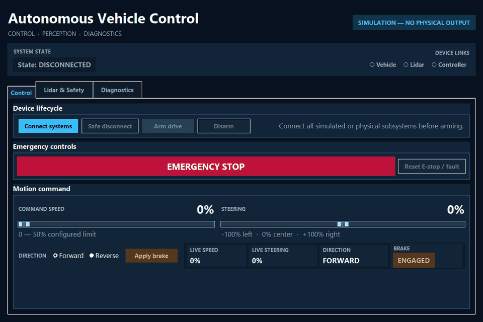
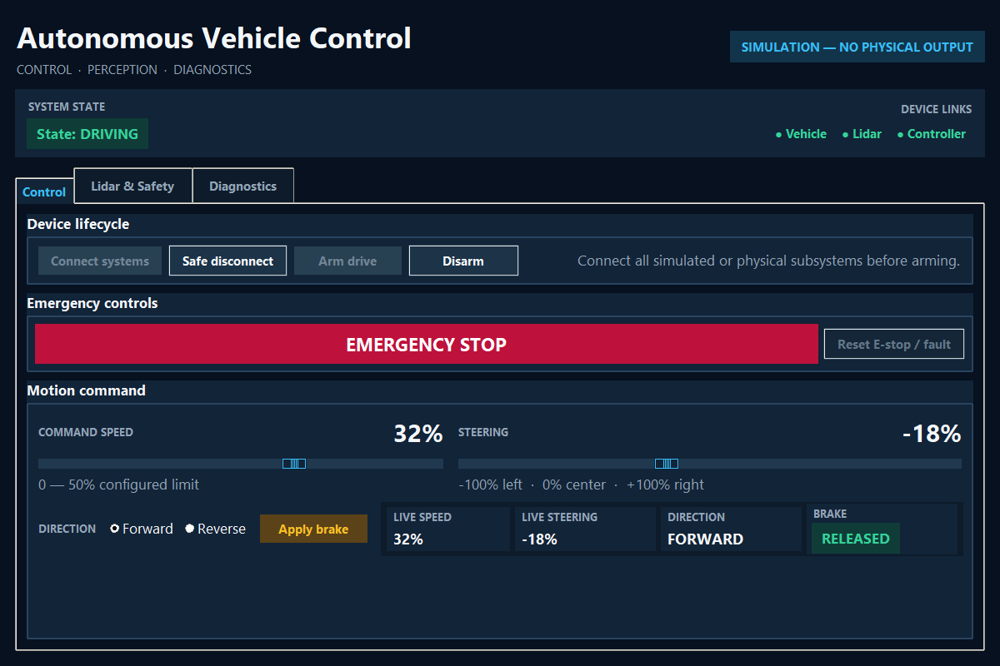
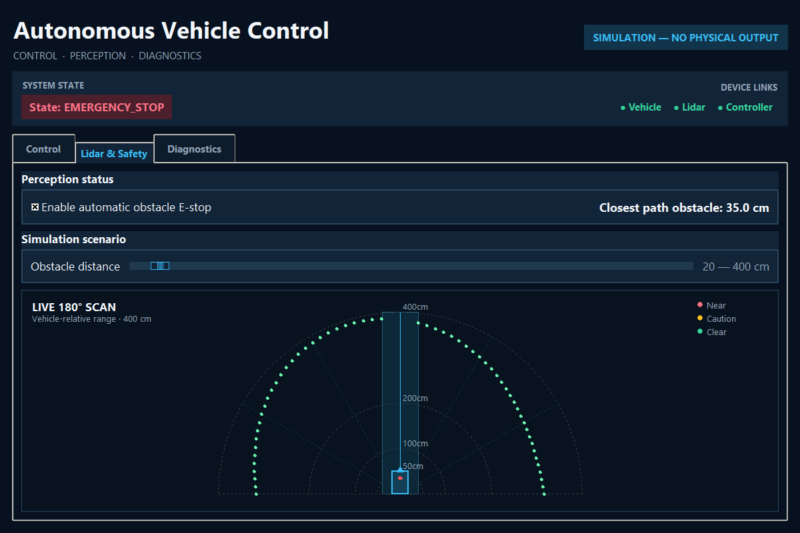
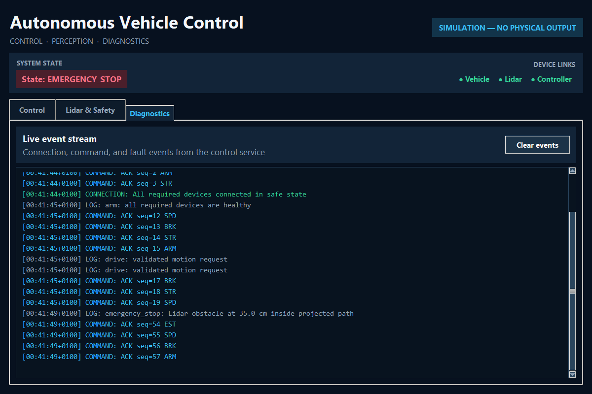
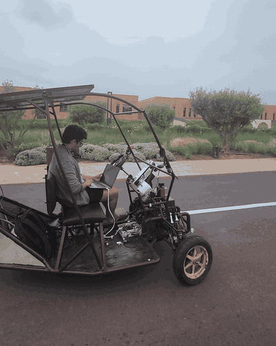

# Autonomous Vehicle Control & AI Perception Platform

I'm Mohamed Amine Chalhy. In 2025, I was part of a twelve-person engineering
team that built and demonstrated a physical autonomous-vehicle platform. It
combined operator control, perception-assisted stopping, and camera inference
on a team-built car. I was responsible for the vehicle software and AI
integration: the Python operator application, game-controller input, serial
communication with the vehicle electronics, RPLidar processing,
obstacle-aware stopping, and camera-based YOLO inference.

The desktop application brings vehicle control, telemetry, RPLidar perception,
and diagnostics together in one interface. It provides hardware and simulation
modes.

## Application walkthrough

This walkthrough follows a complete drive session in simulation. It connects
the vehicle, controller, and Lidar, arms the drive system, applies steering and
throttle, moves an obstacle into the projected path, activates the assisted
stop, and finishes in the diagnostics view.

| Operator control | Lidar-assisted stop |
| :---: | :---: |
|  |  |
| **Live control and telemetry** | **Projected-path obstacle response** |

Hardware and simulation modes use the same control services and device
interfaces. The simulator covers connection handling, vehicle commands, Lidar
processing, assisted stopping, and diagnostics without connecting the car.

Replay the walkthrough locally:

~~~powershell
.\.venv\Scripts\python.exe scripts\dev.py run-sim --showcase
~~~

The [showcase guide](docs/showcase.md) covers the sequence and capture command.

## Physical vehicle demonstration

This drive test shows me operating the vehicle software from the laptop as the
vehicle moves through the campus test route. The wider team covered the
mechanical, electrical, embedded, and vehicle-integration work.

  

Physical drive test

[Watch the MP4](docs/assets/showcase/physical-drive-demo.mp4)
· [Watch the full project showcase](https://www.instagram.com/p/DJD9AVDM7V6/)
· [Read the engineering case study](docs/case-study.md)
· [See test and build results](docs/project-results.md)

## My engineering contribution

I was responsible for the software path from operator input and sensor data to
commands sent to the vehicle electronics.

| Area | My contribution |
| --- | --- |
| Vehicle control | Built the Python/Tkinter workflow for device connection, arming, manual driving, game-controller input, braking, diagnostics, and vehicle feedback |
| Embedded communication | Implemented the USB serial command path between the Windows host and the vehicle electronics |
| Controller input | Converted analog steering, throttle, brake, and direction input into validated vehicle commands |
| Lidar perception | Processed RPLidar scans into a live vehicle-relative view and detected obstacles inside the projected driving path |
| AI perception | Connected camera capture to YOLO inference and displayed labels, confidence scores, bounding boxes, and approximate distance estimates |
| Software design | Structured the application around typed domain, service, adapter, configuration, simulation, and UI layers |
| Project delivery | Set up locked environments, strict type checking, automated tests, pre-commit checks, CI, and Windows packaging |

## Application capabilities

- Drive through the desktop controls or a connected game controller.
- Monitor vehicle, controller, and Lidar connection state and telemetry.
- Convert RPLidar scans into a live vehicle-relative map.
- Detect obstacles inside the projected path and request an assisted stop.
- Exchange commands with the vehicle electronics over USB serial.
- Exercise the operator workflow through the included simulator.

The vehicle demonstration also included camera-based YOLO inference with
annotated detections, confidence scores, and approximate distance estimates. My
vision work covered that camera and application integration. The
[perception engineering notes](docs/perception/yolo-pipeline.md)
describe the pipeline in detail.

## Software architecture

The application separates control state, command handling, device access,
perception, and interface code into typed layers. Hardware and simulator
adapters implement the same contracts.

~~~mermaid
flowchart LR
    UI[Tkinter UI / CLI] --> Services[Application services]
    Services --> Domain[Typed state machine and commands]
    Services --> Dispatcher[Prioritized command dispatcher]
    Services --> Perception[Lidar analysis]
    Dispatcher --> Profiles[Protocol profiles]
    Profiles --> Hardware[Serial vehicle adapter]
    Profiles --> Simulation[Deterministic simulator]
    Perception --> Hardware
    Perception --> Simulation
~~~

This design supports testing of state transitions, command ordering, timeouts,
disconnects, sensor staleness, and obstacle behavior with or without the car.

### Engineering highlights

- **Typed control core:** immutable state, explicit transitions, validated
  commands, and strict mypy checking.
- **Simulator:** in-memory vehicle, controller, and Lidar
  adapters implement the same interfaces as physical devices.
- **Resilient dispatch:** bounded priority queues, sequence-aware protocol
  frames, acknowledgement handling, stale-command rejection, and motion
  eviction on stop transitions.
- **Protocol profiles:** the checksummed protocol-v1 implementation and a
  selectable adapter for the vehicle's newline command dialect.
- **Concurrency boundaries:** device workers never own Tkinter widgets or mutate
  domain state directly.
- **Developer tooling:** Python 3.13, a committed uv lockfile, custom
  bootstrap/development scripts, cross-platform CI, and a PyInstaller Windows
  bundle.

## Quality checks

| Check | Result |
| --- | --- |
| Automated tests | **121 passed** across unit, integration, regression, GUI-support, and simulator behavior |
| Aggregate coverage | **83.59%** |
| Type checking | **Strict mypy** across the application and development tooling |
| Code quality | Ruff formatting and linting, enforced locally and in CI |
| CI platforms | Windows and Ubuntu GitHub-hosted runners |
| Packaging | Python wheel, source distribution, and smoke-tested Windows application bundle |
| Reproducibility | Python version pin, committed uv lockfile, PowerShell/Bash bootstrap scripts, and pre-commit hooks |

Run the full local check with:

~~~powershell
.\.venv\Scripts\python.exe scripts\dev.py check
~~~

See [Project results](docs/project-results.md) and
[Testing strategy](docs/testing.md) for the test setup and commands.

## Code map

These files are good starting points for exploring the implementation:

| Area | File | Details |
| --- | --- | --- |
| Control state machine | [domain/safety.py](src/car_interface/domain/safety.py) | Explicit phases, transition decisions, latching, and stop behavior |
| Command dispatch | [services/dispatcher.py](src/car_interface/services/dispatcher.py) | Priority ordering, bounded queues, acknowledgement tracking, retries, and pacing |
| Protocol compatibility | [domain/protocol_profiles.py](src/car_interface/domain/protocol_profiles.py) | Checksummed protocol v1 and the vehicle command profile |
| Simulation | [adapters/simulated.py](src/car_interface/adapters/simulated.py) | Vehicle, controller, firmware, and Lidar simulators |
| Lidar analysis | [services/lidar_analysis.py](src/car_interface/services/lidar_analysis.py) | Vehicle-relative geometry, projected-path filtering, and closest-obstacle assessment |
| State-machine tests | [test_domain_safety.py](tests/unit/test_domain_safety.py) | Transition and invariant coverage |
| Dispatcher regressions | [test_dispatcher_regressions.py](tests/unit/test_dispatcher_regressions.py) | Ordering, partial writes, pacing, and failure behavior |
| Integrated control behavior | [test_control_service.py](tests/integration/test_control_service.py) | End-to-end service behavior through simulated adapters |

## Run the simulator

The simulator runs the full interface and control architecture without the
vehicle, controller, or Lidar.

### Windows

~~~powershell
git clone https://github.com/Mohemed-Amine-Chalhy/Car_Interface.git
cd Car_Interface
.\scripts\bootstrap.ps1
.\.venv\Scripts\python.exe scripts\dev.py doctor
.\.venv\Scripts\python.exe scripts\dev.py run-sim
~~~

### Linux or macOS

~~~bash
git clone https://github.com/Mohemed-Amine-Chalhy/Car_Interface.git
cd Car_Interface
./scripts/bootstrap.sh
.venv/bin/python scripts/dev.py doctor
.venv/bin/python scripts/dev.py run-sim
~~~

Platform details and command explanations are in
[Getting started](docs/getting-started.md).

## Hardware platform

| Subsystem | Project configuration |
| --- | --- |
| ESP32 board | 38-pin development board with ESP-WROOM-32 module and CP2102 USB-to-UART; configured host serial target |
| Arduino board | Uno R3-form-factor board with DIP ATmega328P; installed role defined by the vehicle firmware and pin map |
| Ranging | USB-connected RPLidar with vehicle-relative scan processing |
| Vision | Host camera with the demonstrated YOLO11n inference pipeline |
| Driver input | pygame-compatible game controller |
| Host | Windows desktop application |

Board specifications, configuration settings, command mappings, and setup notes
are in the [hardware guide](docs/hardware/README.md) and
[firmware guide](docs/firmware/README.md).

## Documentation

- [Engineering case study](docs/case-study.md)
- [Project results](docs/project-results.md)
- [Architecture](docs/architecture.md)
- [Getting started](docs/getting-started.md)
- [Development workflow](docs/development.md)
- [Testing strategy](docs/testing.md)
- [Software showcase and media capture](docs/showcase.md)
- [Vehicle specification](docs/hardware/vehicle-specification.md)
- [ESP32 and Arduino configuration](docs/firmware/board-configuration.md)
- [Perception engineering](docs/perception/README.md)
- [Serial protocol](docs/protocol.md)
- [Team credits](docs/credits.md)

## Team

I developed the vehicle software and AI integration as part of a twelve-person
team spanning mechanical, electrical, embedded, software, and AI engineering.
Everyone who worked on the car is listed in [Credits](docs/credits.md).

## Connecting the physical vehicle

Hardware mode includes the `school_car_legacy_v0` newline command profile for
the vehicle. Before a physical run, configure the serial port and confirm the
connected firmware, pin assignments, and actuator calibration using the
[hardware guide](docs/hardware/README.md).
