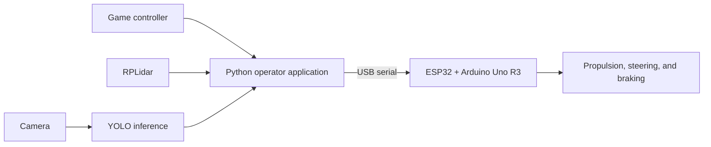
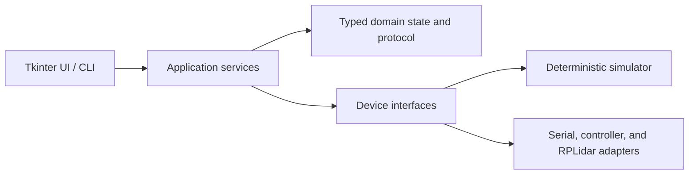

# Autonomous Vehicle Control & AI Perception Platform

[](https://github.com/Mohemed-Amine-Chalhy/Car_Interface/actions/workflows/ci.yml)


**A real autonomous-driving prototype built and demonstrated in 2025 by a
12-engineer multidisciplinary team.** Mohamed Amine Chalhy was responsible for
the vehicle software and YOLO-based AI perception integration: the Python
operator interface, controller and serial communication, RPLidar processing,
obstacle assistance, and camera-inference pipeline.


[Watch the project showcase](https://www.instagram.com/p/DJD9AVDM7V6/)
· [Read the engineering case study](docs/case-study.md)
· [See project results](docs/project-results.md)

## Project at a glance

The project combines a custom vehicle, embedded controllers, range sensing,
computer vision, and a Windows operator application. The physical 2025
prototype proved the integrated concept. The repository now carries a typed,
tested rearchitecture of its host-side control software so the engineering can
be studied, simulated, and extended cleanly.


| Area | What was built |
| --- | --- |
| Vehicle electronics | ESP32 development board and Arduino Uno R3 integrated with the custom chassis and actuators |
| Operator control | Python/Tkinter desktop application with game-controller and manual controls |
| Perception | Real-time RPLidar visualization, path-focused obstacle detection, and YOLO-based camera inference integration |
| Communication | USB serial command path between the host application and embedded control electronics |
| Current engineering | Layered typed package, hardware-free simulator, explicit 2025-car compatibility profile, automated tests, CI, security checks, and Windows packaging |

## What the prototype demonstrated

- A complete team-built vehicle driven through the desktop application and a
  standard game controller.
- Live 2D RPLidar visualization and obstacle detection focused on the vehicle's
  projected path.
- Assisted stopping and operator brake/E-stop controls in the prototype control
  workflow.
- Serial integration with the car's ESP32 and Arduino Uno R3 electronics.
- A YOLO-based camera inference pipeline with real-time detections in the
  original project software.
- A practical integration of mechanical, electrical, embedded, software, and
  AI work into one demonstrated system.

The repository shows **YOLO model integration**, not a claim that a custom model
was trained. Training data, experiment tracking, weights, and accuracy metrics
were not retained in the maintained tree.

## System architecture

### Demonstrated 2025 prototype



The original build used both boards, but the surviving source does not establish
the final division of pins and actuator responsibilities between them. The
[hardware dossier](docs/hardware/README.md) records confirmed facts separately
from values that still need to be recovered from the firmware and wiring.

### Maintained software



The maintained implementation separates presentation, orchestration, domain
logic, and device I/O. This makes control behavior testable without a connected
vehicle and keeps hardware-specific details at adapter boundaries. See the
[architecture guide](docs/architecture.md) for the complete design.

## Engineering highlights

- **Typed control core:** immutable state, explicit transitions, validated
  commands, and strict mypy checking.
- **Deterministic simulation:** in-memory vehicle, controller, and Lidar
  adapters support repeatable development without the physical car.
- **Resilient command delivery:** bounded prioritized dispatch, sequence-aware
  protocol frames, acknowledgement handling, and stale-command rejection.
- **Recovered-car compatibility:** the selectable `school_car_legacy_v0`
  profile translates typed operations into the demonstrated car's newline
  commands without pretending that write-only traffic was acknowledged.
- **Real-time device boundaries:** isolated serial, pygame controller, and
  threaded RPLidar adapters.
- **Production-style tooling:** locked dependencies, Ruff, mypy, pytest,
  Bandit, dependency auditing, pre-commit hooks, CI, SBOMs, and reproducible
  Windows packaging.
- **Operational documentation:** configuration, protocol, hardware setup,
  testing, troubleshooting, and release workflows are documented end to end.

## Timeline

| Phase | Outcome |
| --- | --- |
| 2025 — multidisciplinary build | Twelve engineers designed, integrated, and demonstrated the physical autonomous-vehicle prototype. |
| 2025 — software and perception | Mohamed Amine Chalhy developed the operator software and integrated controller, Lidar, embedded communication, and YOLO-based perception. |
| 2026 — maintained rearchitecture | The experimental scripts were consolidated into a typed layered application with simulation, regression coverage, CI, and packaging. |
| 2026 — compatibility recovery | The maintained host gained an explicit, tested translation profile for the 2025 car's reconstructed newline command dialect. |
| Next — physical profile validation | Recover the exact firmware, pinout, and serial transcript, then exercise that compatibility profile against the existing car. |

## Run the simulator

The simulator is the fastest way to explore the current interface and control
architecture. It does not require the car, a controller, or a Lidar.

### Windows

```powershell
git clone https://github.com/Mohemed-Amine-Chalhy/Car_Interface.git
cd Car_Interface
.\scripts\bootstrap.ps1
.\.venv\Scripts\python.exe scripts\dev.py doctor
.\.venv\Scripts\python.exe scripts\dev.py run-sim
```

### Linux or macOS for logic-only development

```bash
git clone https://github.com/Mohemed-Amine-Chalhy/Car_Interface.git
cd Car_Interface
./scripts/bootstrap.sh
.venv/bin/python scripts/dev.py doctor
.venv/bin/python scripts/dev.py run-sim
```

Requirements and platform details are covered in
[Getting started](docs/getting-started.md).

## Quality checks

The same command surface is used locally and in CI:

```powershell
.\.venv\Scripts\python.exe scripts\dev.py check
```

The suite contains more than 100 non-hardware tests, and CI enforces formatting,
linting, strict type checking, at least 80% aggregate coverage, source security
scanning, and dependency auditing. See [Project results](docs/project-results.md)
and [Testing](docs/testing.md) for reproducible evidence.

## Documentation

- [Engineering case study](docs/case-study.md)
- [Project results](docs/project-results.md)
- [Getting started](docs/getting-started.md)
- [Architecture](docs/architecture.md)
- [Vehicle hardware dossier](docs/hardware/README.md)
- [Vehicle specification](docs/hardware/vehicle-specification.md)
- [Firmware and board dossier](docs/firmware/README.md)
- [Perception dossier](docs/perception/README.md)
- [Configuration reference](docs/configuration.md)
- [Hardware setup](docs/hardware-setup.md)
- [Operator guide](docs/operator-guide.md)
- [Serial protocol](docs/protocol.md)
- [Development workflow](docs/development.md)
- [Testing strategy](docs/testing.md)
- [Troubleshooting](docs/troubleshooting.md)
- [Team credits](docs/credits.md)

## Team

The physical car was a collaborative achievement by twelve engineers spanning
mechanical, electrical, embedded, software, and AI work. The full team is
recognized in [Credits](docs/credits.md).

## Operational note

The 2025 car was physically built and demonstrated with the original prototype
stack. The maintained host now includes a tested `school_car_legacy_v0`
translation for the recovered command dialect, but it has not yet been exercised
against the car's missing firmware and serial transcript. Simulation remains the
supported first run; physical work should follow the documented
[setup](docs/hardware-setup.md) and [configuration](docs/configuration.md).

## Contributing

See [CONTRIBUTING.md](CONTRIBUTING.md) for the development workflow and
[SECURITY.md](SECURITY.md) for private vulnerability reporting.
