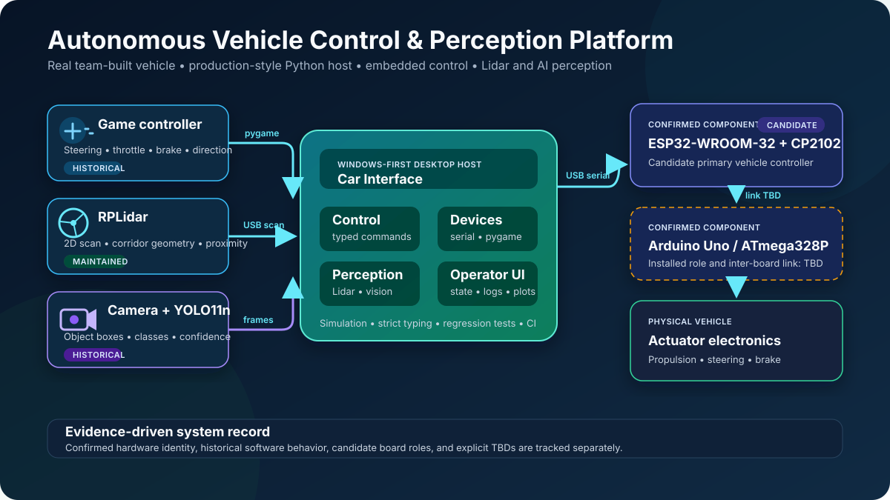

# Autonomous Vehicle Control & AI Perception Platform

**I'm Mohamed Amine Chalhy, and this repository presents my software-engineering
work on a real autonomous-driving car built and demonstrated in 2025 by a
twelve-engineer multidisciplinary team.** I owned the vehicle-software and
AI-integration workstream: the Python operator application, game-controller
input, embedded serial communication, RPLidar processing, obstacle assistance,
and YOLO-based camera inference.

[Watch the full project showcase](https://www.instagram.com/p/DJD9AVDM7V6/)
· [Read the engineering case study](docs/case-study.md)
· [Review verified results](docs/project-results.md)

## My engineering contribution

My contribution connected operator input, real-time sensing, AI inference, and
embedded actuation in one working vehicle platform.

| Area | Software-engineering contribution |
| --- | --- |
| Vehicle control | Built the Python/Tkinter operator workflow for connection state, manual control, game-controller driving, braking, logs, and device feedback |
| Embedded integration | Implemented the USB serial command path between the Windows host and the ESP32/Arduino-based vehicle electronics |
| Controller processing | Normalized analog steering, throttle, brake, and direction inputs into bounded vehicle commands |
| Lidar perception | Converted RPLidar polar scans into a live 2D vehicle-relative view with projected-path obstacle detection |
| AI perception | Integrated camera capture and YOLO inference with labeled detections, confidence scores, bounding boxes, and an approximate-distance overlay |
| Software architecture | Reworked the host into typed domain, service, adapter, configuration, simulation, and UI layers |
| Developer experience | Added locked setup scripts, strict type checking, automated tests, pre-commit checks, CI, and Windows packaging |

## What the physical prototype demonstrated

- Desktop and game-controller operation of the team-built vehicle.
- Live RPLidar visualization and obstacle detection along the projected path.
- Assisted stopping plus explicit brake and emergency-stop controls.
- Host communication with the installed ESP32-WROOM-32 and Arduino Uno R3
  electronics.
- A working camera-to-YOLO detection pipeline in the original project software.
- End-to-end integration across mechanical, electrical, embedded, software, and
  AI disciplines.

The AI contribution is an end-to-end YOLO integration. The retained project
record does not establish a separate custom-training workflow. The maintained
package currently focuses on vehicle control and RPLidar; the demonstrated
camera pipeline is documented in the
[historical YOLO engineering record](docs/perception/historical-yolo-pipeline.md).

## Architecture

The maintained application keeps control decisions independent from GUI and
device libraries:

~~~mermaid
flowchart LR
    UI[Tkinter UI / CLI] --> Services[Application services]
    Services --> Domain[Typed state machine and commands]
    Services --> Dispatcher[Prioritized command dispatcher]
    Services --> Perception[Lidar analysis]
    Dispatcher --> Profiles[Protocol profiles]
    Profiles --> Hardware[Serial vehicle adapter]
    Profiles --> Simulation[Deterministic simulator]
    Perception --> Hardware
    Perception --> Simulation
~~~

The result is a system that can exercise state transitions, command ordering,
timeouts, disconnects, sensor staleness, and obstacle behavior without requiring
the car to be connected.

### Engineering highlights

- **Typed control core:** immutable state, explicit transitions, validated
  commands, and strict mypy checking.
- **Deterministic simulation:** in-memory vehicle, controller, and Lidar
  adapters implement the same interfaces as physical devices.
- **Resilient dispatch:** bounded priority queues, sequence-aware protocol
  frames, acknowledgement handling, stale-command rejection, and motion
  eviction on stop transitions.
- **Explicit protocol profiles:** the checksummed protocol-v1 implementation and
  a selectable adapter for the original car's newline command dialect.
- **Concurrency boundaries:** device workers never own Tkinter widgets or mutate
  domain state directly.
- **Reproducible delivery:** Python 3.13, a committed uv lockfile, custom
  bootstrap/development scripts, cross-platform CI, and a PyInstaller Windows
  bundle.

## Verified software baseline

| Signal | Verified result |
| --- | --- |
| Automated tests | **113 passed** across unit, integration, regression, GUI-support, and simulator behavior |
| Aggregate coverage | **82.94%** |
| Type checking | **Strict mypy** across the application and development tooling |
| Code quality | Ruff formatting and linting, enforced locally and in CI |
| CI platforms | Current Windows and Ubuntu GitHub-hosted runners |
| Packaging | Python wheel, source distribution, and smoke-tested Windows application bundle |
| Reproducibility | Python version pin, committed uv lockfile, PowerShell/Bash bootstrap scripts, and pre-commit hooks |

The complete check is run through the same custom command surface locally and in
CI:

~~~powershell
.\.venv\Scripts\python.exe scripts\dev.py check
~~~

See [Project results](docs/project-results.md) and
[Testing strategy](docs/testing.md) for the reproducible verification path.

## Technical tour

These files are good starting points for reviewing the engineering directly:

| Concern | Representative implementation | What to inspect |
| --- | --- | --- |
| Control state machine | [domain/safety.py](src/car_interface/domain/safety.py) | Explicit phases, transition decisions, latching, and stop behavior |
| Command dispatch | [services/dispatcher.py](src/car_interface/services/dispatcher.py) | Priority ordering, bounded queues, acknowledgement tracking, retries, and pacing |
| Protocol compatibility | [domain/protocol_profiles.py](src/car_interface/domain/protocol_profiles.py) | Checksummed protocol v1 and the explicit school-car legacy translation |
| Simulation | [adapters/simulated.py](src/car_interface/adapters/simulated.py) | Deterministic vehicle, controller, firmware, and Lidar substitutes |
| Lidar analysis | [services/lidar_analysis.py](src/car_interface/services/lidar_analysis.py) | Vehicle-relative geometry, projected-path filtering, and closest-obstacle assessment |
| State-machine tests | [test_domain_safety.py](tests/unit/test_domain_safety.py) | Transition and invariant coverage |
| Dispatcher regressions | [test_dispatcher_regressions.py](tests/unit/test_dispatcher_regressions.py) | Ordering, partial writes, pacing, and failure behavior |
| Integrated control behavior | [test_control_service.py](tests/integration/test_control_service.py) | End-to-end service behavior through simulated adapters |

## Run the simulator

The simulator exercises the current interface and control architecture without
the vehicle, controller, or Lidar.

### Windows

~~~powershell
git clone https://github.com/Mohemed-Amine-Chalhy/Car_Interface.git
cd Car_Interface
.\scripts\bootstrap.ps1
.\.venv\Scripts\python.exe scripts\dev.py doctor
.\.venv\Scripts\python.exe scripts\dev.py run-sim
~~~

### Linux or macOS

~~~bash
git clone https://github.com/Mohemed-Amine-Chalhy/Car_Interface.git
cd Car_Interface
./scripts/bootstrap.sh
.venv/bin/python scripts/dev.py doctor
.venv/bin/python scripts/dev.py run-sim
~~~

Platform details and command explanations are in
[Getting started](docs/getting-started.md).

## Hardware platform

| Subsystem | Project configuration |
| --- | --- |
| Main controller | 38-pin ESP32 development board with ESP-WROOM-32 module and CP2102 USB-to-UART |
| Secondary controller | Arduino Uno R3-form-factor board with DIP ATmega328P |
| Ranging | USB-connected RPLidar with vehicle-relative scan processing |
| Vision | Host camera with the demonstrated YOLO11n inference pipeline |
| Driver input | pygame-compatible game controller |
| Host | Windows desktop application |

Detailed specifications, board settings, command mappings, and reconstruction
steps are available in the [vehicle hardware dossier](docs/hardware/README.md)
and [firmware dossier](docs/firmware/README.md).

## Documentation

- [Engineering case study](docs/case-study.md)
- [Project results](docs/project-results.md)
- [Architecture](docs/architecture.md)
- [Getting started](docs/getting-started.md)
- [Development workflow](docs/development.md)
- [Testing strategy](docs/testing.md)
- [Vehicle specification](docs/hardware/vehicle-specification.md)
- [ESP32 and Arduino configuration](docs/firmware/board-configuration.md)
- [Perception engineering](docs/perception/README.md)
- [Serial protocol](docs/protocol.md)
- [Team credits](docs/credits.md)

## Team

The physical car was a collaborative achievement by twelve engineers spanning
mechanical, electrical, embedded, software, and AI work. I owned the
vehicle-software and AI-integration scope described above. The full team is
recognized in [Credits](docs/credits.md).

## Hardware compatibility status

The car was physically built and demonstrated with the original stack. The
maintained host includes a regression-tested translation for the recovered
command dialect; final vehicle-side validation requires the original firmware,
serial transcript, pin map, and actuator calibration.
