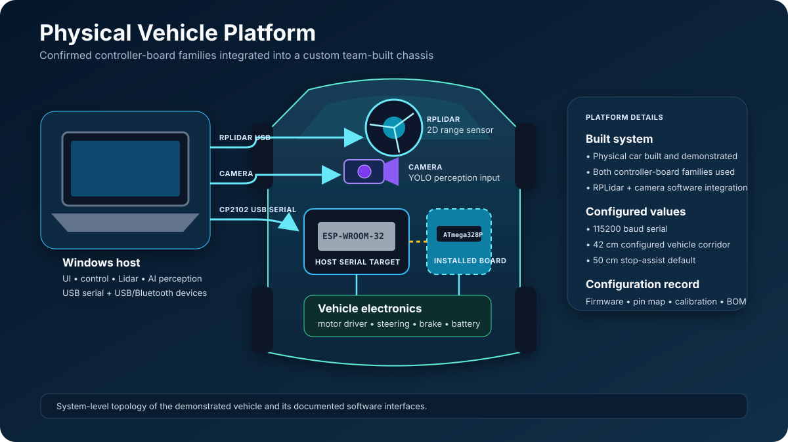
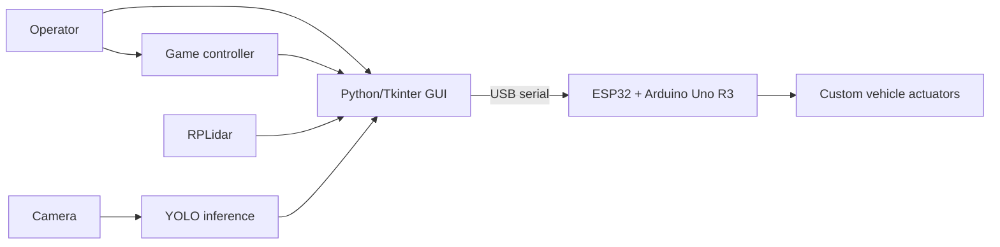

# Engineering case study

## Autonomous Vehicle Control & AI Perception Platform

In 2025, a multidisciplinary team of twelve engineers built and demonstrated a
physical autonomous-driving car as an academic engineering project. The system
combined a custom chassis, embedded control electronics, a Windows operator
application, game-controller input, RPLidar sensing, and camera-based AI
perception.

Mohamed Amine Chalhy was responsible for the vehicle software and YOLO-based AI
perception integration. His scope covered the Python operator interface,
controller input, serial communication with the embedded electronics, live
Lidar processing and visualization, obstacle-assistance behavior, and the
camera inference pipeline.

[View the recorded project showcase](https://www.instagram.com/p/DJD9AVDM7V6/)

## The engineering challenge

The team needed to bring several independently complex systems together:

- a custom vehicle with propulsion, steering, and braking hardware;
- ESP32 and Arduino Uno R3 control electronics;
- a game controller with analog input;
- a rotating Lidar producing polar range measurements;
- a camera and YOLO inference pipeline; and
- a desktop interface that could coordinate devices and give the operator
  useful feedback in real time.

The core software challenge was integration. Device APIs, serial traffic,
sensor updates, user actions, and inference all run at different rates. The
operator still needs a coherent view of connection state, motion commands,
obstacles, and detections.

## Mohamed Amine Chalhy's contribution

### Operator and vehicle-control software

The original Python application brought the vehicle workflow into one desktop
interface. It connected to the microcontroller over serial, exposed manual and
game-controller driving modes, surfaced operational logs, and provided direct
brake and emergency-stop controls.

Controller input was translated into steering, throttle, direction, and brake
intent. That required normalizing analog values and converting them into the
command ranges expected by the embedded controller.

### Lidar integration

The RPLidar path converted polar scan samples into a live 2D representation.
The software also projected a corridor in front of the car, identified nearby
points inside that corridor, highlighted potential obstacles, and supported an
assisted stop threshold.

This was more than displaying a sensor feed: it connected geometric processing
to an operator decision and a vehicle-control response.

### YOLO-based AI perception

The prototype software integrated a camera feed with YOLO inference and
displayed detections with class labels and confidence information. The
engineering contribution documented here is model and inference-pipeline
integration. The maintained repository does not contain the evidence needed to
claim original dataset creation or custom model training, so it intentionally
does not make that claim. The surviving implementation is reconstructed in the
[historical YOLO pipeline](perception/historical-yolo-pipeline.md).

### Cross-disciplinary integration

Software behavior had to match the electrical and mechanical system built by
the rest of the team. The application therefore sat at the boundary between
operator input, sensor interpretation, embedded commands, and physical vehicle
behavior. This work was part of a broader twelve-person collaboration; see
[Team credits](credits.md).

## Demonstrated system





The physical prototype and control interface were demonstrated together. The
recorded media shows the real vehicle rather than a rendered concept. The exact
division of actuator responsibilities and pin assignments between the ESP32 and
Arduino Uno was not preserved in this repository, so those details should be
recovered from the original firmware before a board-level schematic is treated
as authoritative. The [hardware dossier](hardware/README.md) tracks confirmed
components, topology, specifications, and open identification work.

## From prototype to maintained software

The original implementation optimized for getting a multidisciplinary hardware
project working on schedule. The current repository preserves that project
story while restructuring the host application for long-term software quality.

| Prototype need | Maintained engineering response |
| --- | --- |
| Several hardware libraries and GUI callbacks | Device interfaces and dependency-injected adapters |
| Hardware needed for most testing | Deterministic simulated vehicle, controller, and Lidar |
| Command strings assembled across the UI | Typed commands with acknowledged `car_v1` and write-only `school_car_legacy_v0` profiles |
| Concurrent GUI and device activity | Bounded event delivery and explicit worker ownership |
| Machine-specific settings | Strict TOML, environment, and CLI configuration precedence |
| Manual confidence checks | Unit, integration, regression, and opt-in hardware test layers |
| Ad hoc setup | Locked dependencies, bootstrap scripts, pre-commit hooks, and CI |

The maintained dependency direction is intentionally simple:

```text
Tkinter UI / CLI
        |
        v
application services  --->  presentation events
        |
        v
typed domain model and protocol
        ^
        |
real or simulated device adapters
```

More detail is available in [Architecture](architecture.md).

## Engineering decisions worth highlighting

### Simulation as an executable specification

The in-memory adapters implement the same boundaries as physical devices. They
allow control sequences, state transitions, command ordering, reconnection, and
fault behavior to be exercised deterministically without special equipment.

### Domain logic independent of the GUI

Control state and transitions do not depend on Tkinter, pygame, serial ports,
or the system clock. This makes important behavior testable as ordinary Python
and prevents the UI from becoming the owner of device policy.

### Explicit device boundaries

Serial, controller, and Lidar behavior are isolated behind small interfaces.
The dispatcher exclusively owns command transactions, and high-frequency sensor
updates do not directly mutate widgets from worker threads.

### An explicit bridge back to the demonstrated car

The maintained host includes a selectable `school_car_legacy_v0` profile. It
translates typed operations into the reconstructed `A`, `M`, `D F`, `D R`,
`V`, `W`, `S 1`, and `Q 1` newline commands, applies the historical steering
calibration and 50 ms pacing, and reports legacy writes without fabricating
firmware acknowledgements.

This compatibility layer is covered by automated encoding, pacing, partial-write,
configuration, and composition tests. The original firmware and a captured
serial transcript are still needed to verify it against the existing car.

### Reproducible developer experience

The current repository pins its environment with `uv`, uses one cross-platform
development command surface, enforces Ruff and strict mypy checks, runs pytest
in CI on Windows and Ubuntu, audits dependencies, and produces a Windows
package, checksums, and an SBOM.

## Outcome

The project delivered two valuable outcomes:

1. A real, team-built autonomous-vehicle prototype that integrated embedded
   control, operator software, Lidar sensing, and AI perception and was
   demonstrated in 2025.
2. A production-style rearchitecture that turns the host-side lessons from the
   prototype into a typed, testable, and reproducible software project.

See [Project results](project-results.md) for the evidence that is currently
available and the measurements that should be captured during the next physical
vehicle session.

## Current boundary

The maintained application now has an explicit compatibility path for the
reconstructed 2025 command dialect. The original car exists and was
demonstrated, but that path has not yet been exercised against its firmware.
Recovering the board firmware, serial transcript, pinout, and exact actuator
calibration is the next step toward a fully reproducible hardware profile. See the
[vehicle specification](hardware/vehicle-specification.md),
[firmware dossier](firmware/README.md), [Hardware setup](hardware-setup.md), and
[Configuration](configuration.md).
