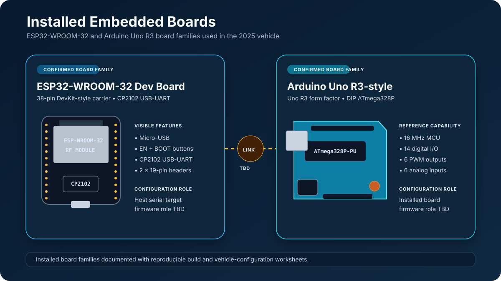

# Controller-board and firmware dossier

The physical car used both an ESP32-WROOM-32 development board and an Arduino
Uno R3-style ATmega328P board. The repository contains strong evidence for the
ESP32 as the host-facing vehicle controller, but it does not contain either
board's firmware or a wiring schematic. The Uno's installed responsibility is
therefore left open rather than invented.



## Reconstructed topology

```text
Windows host
  ├─ USB serial ─> ESP32-WROOM-32 development board (candidate primary ECU)
  ├─ USB serial ─> RPLidar
  ├─ USB/Bluetooth ─> game controller
  └─ camera capture ─> YOLO11n pipeline (historical)

ESP32 ── connection TBD ── Arduino Uno / ATmega328P (installed role TBD)
  └─ actuator-driver connections and GPIO assignments TBD
```

## Firmware status

| Item | Current evidence |
| --- | --- |
| ESP32 board family | **Confirmed:** ESP-WROOM-32 on a 38-pin CP2102 carrier |
| Uno board family | **Confirmed:** Uno R3 form factor with DIP ATmega328P |
| ESP32 firmware source/binary | **TBD:** not present in the repository |
| Uno firmware source/binary | **TBD:** not present in the repository |
| Installed pin map | **TBD:** no schematic or continuity record |
| Inter-board transport | **TBD:** UART, I²C, SPI, or independent USB cannot be selected from current evidence |
| Original host dialect | **Historical:** integrated newline command set documented in [legacy-protocol.md](legacy-protocol.md) |
| Maintained host dialects | **Implemented:** checksummed/acknowledged [protocol v1](../protocol.md) and explicit write-only [`school_car_legacy_v0`](legacy-protocol.md) |

## Documents

- [Board configuration](board-configuration.md) records the confirmed board
  capabilities, reproducible build templates, and pin-assignment worksheet.
- [Historical vehicle protocol](legacy-protocol.md) reconstructs the original
  command dialect and identifies variations found in experiments.
- [Firmware compatibility](../firmware-compatibility.md) defines how a firmware
  artifact is paired with a maintained host release.
- [Hardware inventory](../hardware/component-inventory.md) tracks the evidence
  still needed from the physical car.

## Recommended maintained architecture

If inspection confirms that both boards remain active, a clear responsibility
split would be:

| Layer | Recommended owner |
| --- | --- |
| Host USB protocol, sequence/CRC validation, watchdog supervision | ESP32 |
| Vehicle state machine and normalized command mapping | ESP32 |
| Time-critical auxiliary actuator service, only if genuinely required | Uno |
| Motor/steering/brake driver outputs | Whichever board the recovered wiring proves, captured in one pin map |
| Camera, YOLO inference, RPLidar geometry, UI | Windows host |

That table is a forward architecture recommendation, not a claim about the
historical wiring. A single ESP32 may be sufficient if the Uno performed no
installed function; the inventory should drive that decision.
