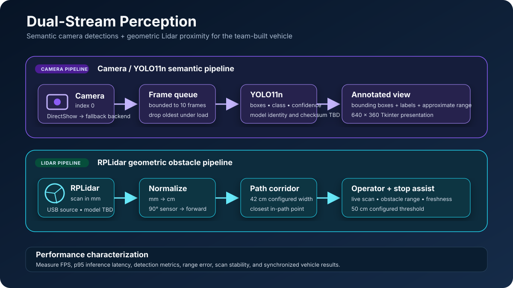

# Perception engineering

The original vehicle software combined two complementary perception streams:
2D RPLidar geometry for obstacle proximity and a camera/YOLO11n pipeline for
semantic object detection. The maintained application continues the Lidar
analysis path; the camera and YOLO code remain documented historical work and
are not packaged in v0.1.



## Capability map

| Capability | Original prototype | Maintained host | Evidence |
| --- | --- | --- | --- |
| RPLidar acquisition | Implemented | Implemented | Source and tests |
| Millimetre-to-centimetre normalization | Implemented | Implemented | Source and tests |
| Vehicle-relative scan angles | 90° sensor angle treated as forward | Configurable analysis around vehicle forward | Historical source / maintained source |
| Projected-path obstacle detection | 42 cm configured corridor | 42 cm default corridor | Historical source / maintained tests |
| Stop-assist distance | 50 cm default | 50 cm default | Historical source / maintained config |
| Camera capture | Camera index 0, DirectShow fallback | Not shipped in v0.1 | Historical source |
| YOLO inference | `yolo11n.pt` through Ultralytics | Not shipped in v0.1 | Historical source |
| Detection overlay | Class, confidence, box, approximate distance | Not shipped in v0.1 | Historical source |
| Path planning / trajectory control | Not established | Not implemented | No supporting artifact |

## Engineering contribution

Mohamed Amine Chalhy's role covered the vehicle software and AI-model
integration: device orchestration, serial control, controller mapping, Lidar
processing, the operator interface, camera capture, YOLO inference, and
detection visualization. The repository demonstrates model integration; custom
training should only be claimed when a dataset, training configuration, weights,
and evaluation results are recovered.

## Lidar geometry

The integrated prototype converted each RPLidar measurement from millimetres to
centimetres, rotated the sensor frame so 90° represented vehicle-forward, and
checked whether each point intersected the configured vehicle corridor:

```text
vehicle_angle = sensor_angle - 90°
lateral_distance = abs(distance_cm × sin(vehicle_angle))
in_path = lateral_distance <= vehicle_width_cm / 2
```

With the historical 42 cm corridor, points within 21 cm of the projected
centerline were treated as in-path. The final integrated settings used a 180°
front view, a 500 cm analysis horizon, a 2000 cm display horizon, five scans of
history, and a 50 cm stop-assist default.

## Vision status

The historical pipeline is reconstructed in
[historical-yolo-pipeline.md](historical-yolo-pipeline.md). Restoring it to the
maintained package requires a typed, optional subsystem with pinned model
provenance and real performance measurements. The implementation and validation
sequence is in [restoration-plan.md](restoration-plan.md).

## Results that remain to measure

The original repository does not contain a reproducible benchmark report. A
future physical-car record should publish:

- camera capture resolution and frames per second;
- median and 95th-percentile inference latency on the project host;
- end-to-end display latency and frame-drop rate;
- model classes, test-set precision, recall, and mAP where applicable;
- approximate-distance error at fixed measured ranges;
- RPLidar scan rate, drop/stale rate, and known-distance error; and
- stop-assist trigger distance across repeated approaches.

Publishing measured values in those fields will make the engineering work more
credible than an unqualified “real-time” or “accurate” claim.
